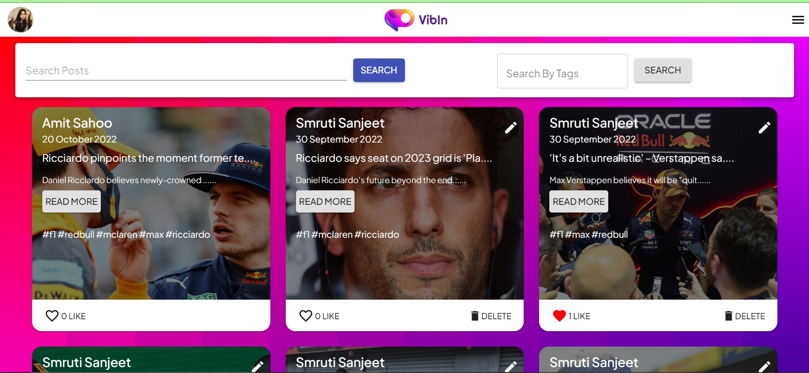
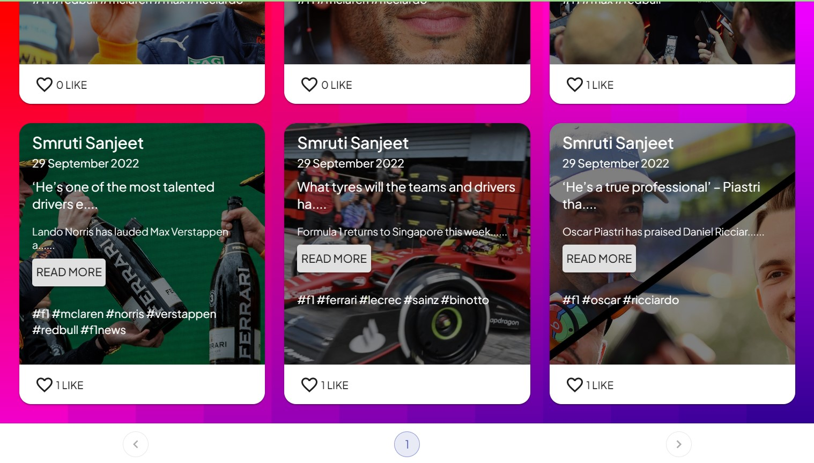
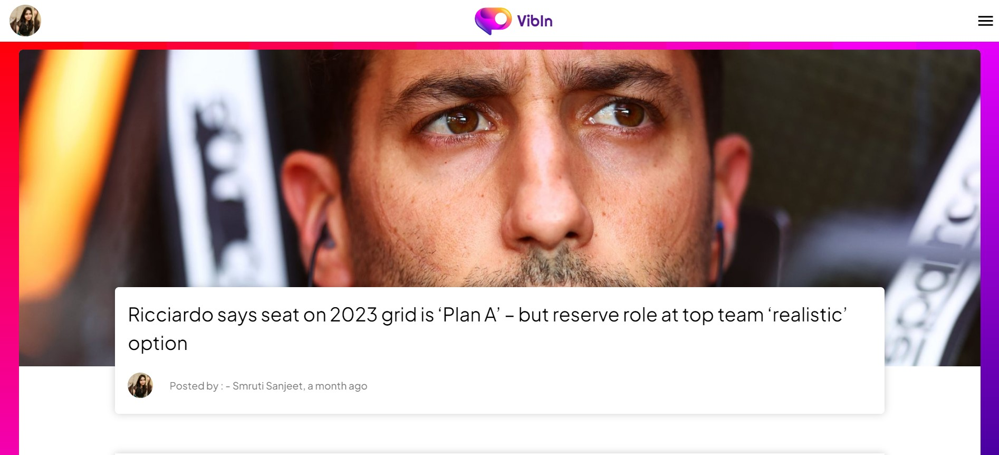
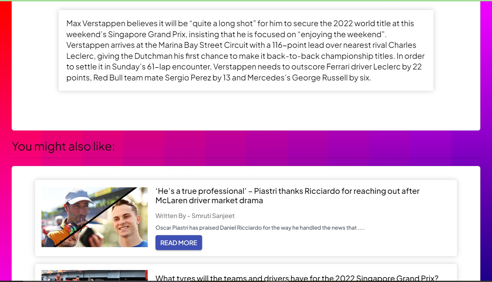
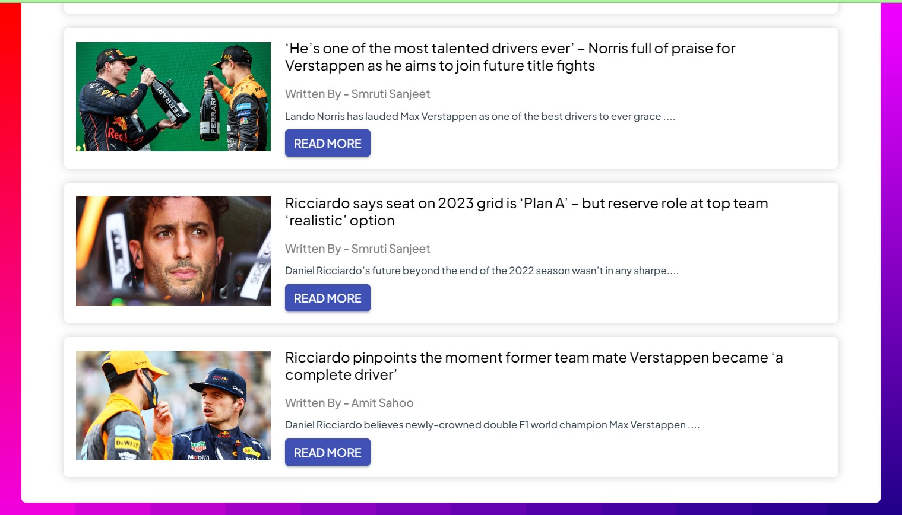
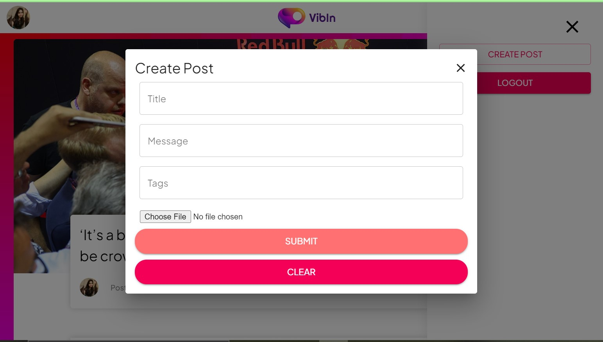
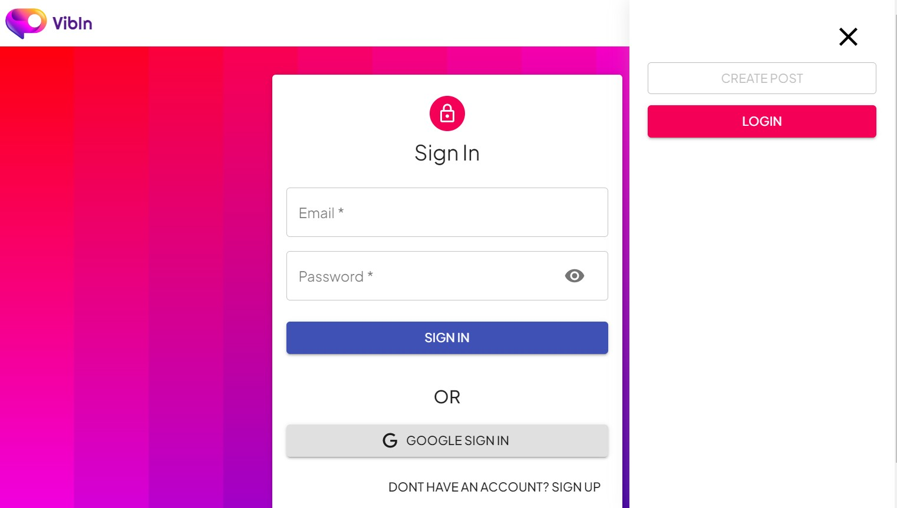
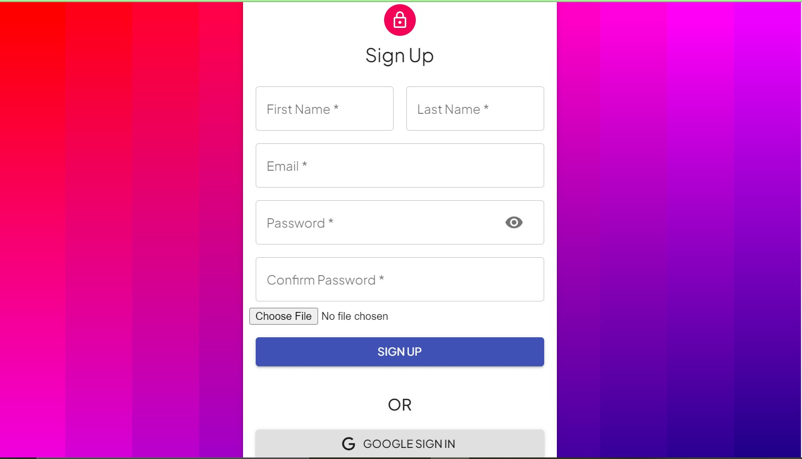

# VibIn - A Social Media App

VibIn is a Web Application built on M.E.R.N that promotes the production or exchange of information, ideas, career interests, and other kinds of expression through virtual communities and networks. An app that allows you to communicate with others on a local, regional, national, and even international scale. A platform where individuals can connect with others from all around the world, exchange their ideas, and learn about various cultures.

Front-end - [CLICK HERE](https://github.com/AmitSahoo45/Vibin-Frontend)  
Full Stack App - This One!!!

Tech Stack used -
1. 
2. 
3. 
4. 
5. 
6. 

## Features

- Signup and Login
- Create a profile.
- Edit Posts(Change Title, Picture, Description, Tags).
- Share posts(Photos, Text posts).
- Comment and Like on Posts.
- Search other people’s posts

Attached Screenshots of the App -

  
1.1 ScreenShot - Landing Page

  
  
1.2 ScreenShot - Single Post Page

  
  
2.1 ScreenShot - Single Post Page

  
  
2.2 ScreenShot - Single Post Page

  
  
2.3 ScreenShot - Single Post Page

  
  
3 ScreenShot - Create Post Modal

  
  
4.1 ScreenShot - Login Page

  
  
4.2 ScreenShot - SignUp Page

  

